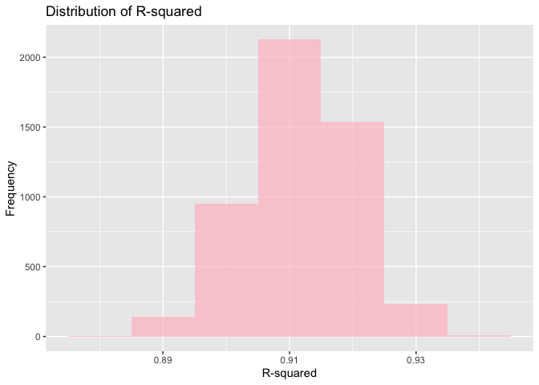
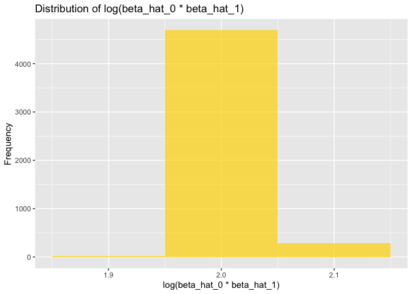
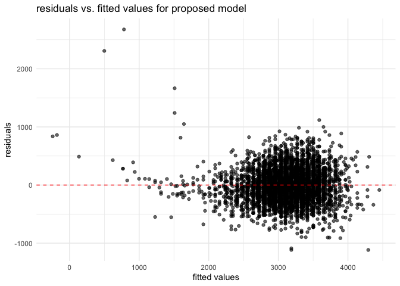

p8105_hw6_yz4993
================
Yixin Zheng
2024-12-01

# Problem 1

``` r
weather_df <- rnoaa::meteo_pull_monitors(
  c("USW00094728"),
  var = c("PRCP", "TMIN", "TMAX"), 
  date_min = "2017-01-01",
  date_max = "2017-12-31"
) %>%
  mutate(
    name = recode(id, USW00094728 = "CentralPark_NY"),
    tmin = tmin / 10,
    tmax = tmax / 10
  ) %>%
  select(name, id, everything())
```

    ## using cached file: /Users/cecilyzheng/Library/Caches/org.R-project.R/R/rnoaa/noaa_ghcnd/USW00094728.dly

    ## date created (size, mb): 2024-11-27 10:24:31.23222 (8.667)

    ## file min/max dates: 1869-01-01 / 2024-11-30

``` r
# define function
bootstrap_sample <- function(df) {
  sample_frac(df, replace = TRUE)
}

# bootstrapping, 5000 samples with replacement
results_p1 <- 
  tibble(bootstrap_id = 1:5000) %>%
  mutate(
    bootstrap_sample = map(bootstrap_id, ~ bootstrap_sample(weather_df)),
    bootstrap_model = map(bootstrap_sample, ~ lm(tmax ~ tmin, data = .x)),
    # extract r-squared and compute log(beta0 * beta1)
    r_squared = map_dbl(bootstrap_model, ~ glance(.x)$r.squared),
    log_beta = map_dbl(bootstrap_model, ~ {
      coefs <- tidy(.x)
      log(coefs$estimate[1] * coefs$estimate[2])
    })
  )

# 95% confidence intervals
ci_r_squared <- results_p1 %>% 
  summarize(ci_low = quantile(r_squared, 0.025), 
            ci_high = quantile(r_squared, 0.975))

ci_log_beta <- results_p1 %>% 
  summarize(ci_low = quantile(log_beta, 0.025), 
            ci_high = quantile(log_beta, 0.975))

ci_r_squared %>% 
  mutate(parameter = "R-squared") %>%
  bind_rows(ci_log_beta %>% mutate(parameter = "log(beta_hat_0 * beta_hat_1)")) %>%
  select(parameter, ci_low, ci_high) %>%
  knitr::kable(digits = 3, col.names = c("Parameter", "2.5% Quantile", "97.5% Quantile"))
```

| Parameter                     | 2.5% Quantile | 97.5% Quantile |
|:------------------------------|--------------:|---------------:|
| R-squared                     |         0.894 |          0.927 |
| log(beta_hat_0 \* beta_hat_1) |         1.965 |          2.060 |

``` r
# plot distributions
r_squared_plot <- 
  results_p1 %>%
  ggplot(aes(x = r_squared)) +
  geom_histogram(binwidth = 0.01, fill = "pink", alpha = 0.7) +
  labs(
    title = "Distribution of R-squared",
    x = "R-squared",
    y = "Frequency"
  )

log_beta_plot <- 
  results_p1 %>%
  ggplot(aes(x = log_beta)) +
  geom_histogram(binwidth = 0.1, fill = "gold", alpha = 0.7) +
  labs(
    title = "Distribution of log(beta_hat_0 * beta_hat_1)",
    x = "log(beta_hat_0 * beta_hat_1)",
    y = "Frequency"
  )

r_squared_plot
```

<!-- -->

``` r
log_beta_plot
```

<!-- -->

Description of Distributions:

The histogram of R-squared values peaked and centered around 0.91. The
distribution is slightly left skewed. The 95% CI, as shown in the
summary table, takes the range from 0.894 to 0.927, which means that the
model explains approximately 89.4% to 92.7% of data variance in 95% of
bootstrap samples. The histogram of (log($\beta_0 * \beta_1$)) is
sharply peaked and centered around 2.0. The distribution is very
concentrated, with only a little variation around 2.0 to 2.1. The 95%
CI, as shown in the summary table, takes the range from 1.965 to 2.057.

# Problem 2

``` r
homicide_data <- read_csv("~/Desktop/Data Science/HW/HW6/p8105_hw6_yz4993/data/homicide-data.csv") %>%
  janitor::clean_names() %>%
  mutate(city_state = str_c(city, state, sep = ", "),
         resolved_case = if_else(disposition == "Closed by arrest", 1, 0),
         victim_age = as.numeric(victim_age)) %>%
  filter(!city_state %in% c("Dallas, TX", 
                            "Phoenix, AZ", 
                            "Kansas City, MO", 
                            "Tulsa, AL")) %>%
  filter(victim_race %in% c("White", "Black")) %>%
  drop_na(victim_race, victim_sex, victim_age)
```

    ## Rows: 52179 Columns: 12
    ## ── Column specification ────────────────────────────────────────────────────────
    ## Delimiter: ","
    ## chr (9): uid, victim_last, victim_first, victim_race, victim_age, victim_sex...
    ## dbl (3): reported_date, lat, lon
    ## 
    ## ℹ Use `spec()` to retrieve the full column specification for this data.
    ## ℹ Specify the column types or set `show_col_types = FALSE` to quiet this message.

    ## Warning: There was 1 warning in `mutate()`.
    ## ℹ In argument: `victim_age = as.numeric(victim_age)`.
    ## Caused by warning:
    ## ! NAs introduced by coercion

``` r
baltimore <- homicide_data %>%
  filter(city_state == "Baltimore, MD")

# logistic regression 
baltimore_glm <- glm(resolved_case ~ victim_age + victim_sex + victim_race, 
                     data = baltimore, 
                     family = binomial())

baltimore_results <- baltimore_glm %>%
  broom::tidy(conf.int = TRUE, exponentiate = TRUE) %>%
  filter(term == "victim_sexMale") %>%
  select(term, estimate, conf.low, conf.high)

baltimore_results
```

    ## # A tibble: 1 × 4
    ##   term           estimate conf.low conf.high
    ##   <chr>             <dbl>    <dbl>     <dbl>
    ## 1 victim_sexMale    0.426    0.324     0.558

``` r
city_results <- homicide_data %>%
  group_by(city_state) %>%
  nest() %>%
  mutate(
    city_model = map(data, ~ glm(resolved_case ~ victim_age + victim_sex + victim_race, 
                                data = .x, 
                                family = binomial())),
    glm_tidy = map(city_model, ~ broom::tidy(.x, conf.int = TRUE, exponentiate = TRUE)),
    sex_or = map(glm_tidy, ~ filter(.x, term == "victim_sexMale"))) %>%
  unnest(sex_or) %>%
  select(city_state, estimate, conf.low, conf.high)
```

    ## Warning: There were 45 warnings in `mutate()`.
    ## The first warning was:
    ## ℹ In argument: `glm_tidy = map(city_model, ~broom::tidy(.x, conf.int = TRUE,
    ##   exponentiate = TRUE))`.
    ## ℹ In group 1: `city_state = "Albuquerque, NM"`.
    ## Caused by warning:
    ## ! glm.fit: fitted probabilities numerically 0 or 1 occurred
    ## ℹ Run `dplyr::last_dplyr_warnings()` to see the 44 remaining warnings.

``` r
city_results
```

    ## # A tibble: 47 × 4
    ## # Groups:   city_state [47]
    ##    city_state      estimate conf.low conf.high
    ##    <chr>              <dbl>    <dbl>     <dbl>
    ##  1 Albuquerque, NM    1.77     0.825     3.76 
    ##  2 Atlanta, GA        1.00     0.680     1.46 
    ##  3 Baltimore, MD      0.426    0.324     0.558
    ##  4 Baton Rouge, LA    0.381    0.204     0.684
    ##  5 Birmingham, AL     0.870    0.571     1.31 
    ##  6 Boston, MA         0.674    0.353     1.28 
    ##  7 Buffalo, NY        0.521    0.288     0.936
    ##  8 Charlotte, NC      0.884    0.551     1.39 
    ##  9 Chicago, IL        0.410    0.336     0.501
    ## 10 Cincinnati, OH     0.400    0.231     0.667
    ## # ℹ 37 more rows

``` r
city_results <- city_results %>%
  arrange(estimate) %>%
  mutate(city_state = factor(city_state, levels = city_state))

city_plot <- city_results %>%
  ggplot(aes(x = city_state, y = estimate)) +
  geom_point(color = "gold", size = 1.5) +
  geom_errorbar(aes(ymin = conf.low, ymax = conf.high), width = 0.3) +
  coord_flip() +
  labs(
    title = "Adjusted OR and CIs for Male vs Female Victims by City",
    x = "City",
    y = "Adjusted Odds Ratio (OR)"
  ) +
  theme_minimal(base_size = 14)
city_plot
```

<!-- -->
The plot above shows the adjusted odd ratios and the 95% confidence
intervals for solving homicides comparing male victims to female
victims, organized by odd ratio. We see from the plot that most of the
cities have OR around 0 to 1 (near 1), which means that they have no
significant difference in the rates for solving homicides between
different sex. Yet some of the cities have ORs significantly above or
below 1(like Albuquerque, NM or Atlanta, CA), suggesting the difference
in the rates for solving homicides between different sex. Some cities
also have a wide CI, which suggest variability, with some other have
narrower one which would give a more precise result.

# Problem 3

``` r
birthweight <- read_csv("~/Desktop/Data Science/HW/HW6/p8105_hw6_yz4993/data/birthweight.csv") %>%
  janitor::clean_names()
```

    ## Rows: 4342 Columns: 20
    ## ── Column specification ────────────────────────────────────────────────────────
    ## Delimiter: ","
    ## dbl (20): babysex, bhead, blength, bwt, delwt, fincome, frace, gaweeks, malf...
    ## 
    ## ℹ Use `spec()` to retrieve the full column specification for this data.
    ## ℹ Specify the column types or set `show_col_types = FALSE` to quiet this message.

``` r
birthweight_data <- birthweight %>%
  mutate(
    babysex = factor(babysex, levels = c(1, 2), labels = c("Male", "Female")),
    frace = factor(frace, levels = c(1, 2, 3, 4, 8), 
                   labels = c("White", "Black", "Asian", "Puerto Rican", "Other")),
    mrace = factor(mrace, levels = c(1, 2, 3, 4, 8), 
                   labels = c("White", "Black", "Asian", "Puerto Rican", "Other")),
    malform = factor(malform, levels = c(0, 1), labels = c("Absent", "Present"))
  ) %>%
  drop_na()
```

``` r
proposed_model <- lm(bwt ~ blength + bhead, data = birthweight_data)

birthweight_data <- birthweight_data %>%
  add_predictions(proposed_model, var = "predicted_bwt") %>%
  add_residuals(proposed_model, var = "residuals")

ggplot(birthweight_data, aes(x = predicted_bwt, y = residuals)) +
  geom_point(alpha = 0.6) +
  geom_hline(yintercept = 0, linetype = "dashed", color = "red") +
  labs(
    title = "residuals vs. fitted values for proposed model",
    x = "fitted values",
    y = "residuals"
  ) +
  theme_minimal()
```

<!-- --> The
proposed regression model was developed to predict the birth weight
based on gestational age in weeks, baby’s length at birth
(centimeteres), and baby’s head circumference at birth (centimeters). We
chose these predictors because they all related to the physical aspect
of the baby, reflecting baby’s physical development, and is a continuous
numeric variable.

To assess the fit of the model, we calculate residuals and fitted values
using functions. The residuals vs. fitted values plot shows the
residuals randomly scattered around the horizontal line (0), suggesting
that there is no strong evidence of bias in the proposed model, however,
we do also observe some patterns, which means that the model might have
not capture all the complexities, suggesting future research to include
more predictors or do some transformations.

``` r
model_1 <- lm(bwt ~ blength + gaweeks, data = birthweight_data)
model_2 <- lm(bwt ~ bhead * blength * babysex, data = birthweight_data)

cross_validation_data <- crossv_mc(birthweight_data, n = 100)

cross_validation_results <- cross_validation_data %>%
  mutate(
    proposed_model = map(train, ~ lm(bwt ~ gaweeks + blength + wtgain + bhead + smoken, data = .x)),
    model_1 = map(train, ~ lm(bwt ~ blength + gaweeks, data = .x)),
    model_2 = map(train, ~ lm(bwt ~ bhead * blength * babysex, data = .x)),
    rmse_proposed = map2_dbl(proposed_model, test, ~ rmse(model = .x, data = .y)),
    rmse_model_1 = map2_dbl(model_1, test, ~ rmse(model = .x, data = .y)),
    rmse_model_2 = map2_dbl(model_2, test, ~ rmse(model = .x, data = .y))
  )

rmse_summary <- cross_validation_results %>%
  summarise(
    mean_rmse_proposed = mean(rmse_proposed),
    mean_rmse_model1 = mean(rmse_model_1),
    mean_rmse_model2 = mean(rmse_model_2)
  )

rmse_summary
```

    ## # A tibble: 1 × 3
    ##   mean_rmse_proposed mean_rmse_model1 mean_rmse_model2
    ##                <dbl>            <dbl>            <dbl>
    ## 1               284.             334.             290.

Looking at the RMSE summary table, we see that the proposed model (mean
RMSE = 282.86) is better than the other 2 in terms of accuracy, Model 1,
has a highest RMSE (330.67). And Model 2, is also higher with a mean
RMSE of 288.05, but this one is not a huge difference. This might
suggest over-fitting, more specifically, the added interaction in model
2, may not improve prediction performance.
